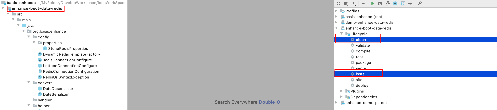

**csdn博客：**[https://blog.csdn.net/Hellowenpan?spm=1000.2115.3001.5343](https://blog.csdn.net/Hellowenpan?spm=1000.2115.3001.5343)

**个人博客**：[http://www.bad-guy.cn](http://www.bad-guy.cn)

**使用示例见**：[https://github.com/wenpanwenpan/redis-dynamic-datasource](https://github.com/wenpanwenpan/redis-dynamic-datasource)

## 一、功能特性

### 1、功能简介

该工程是基于spring-boot-starter-data-redis（spring-boot-starter-parent版本2.4.8）模块，实现了Redis动态切换db以及多Redis数据源支持，具体功能如下

- redis多数据源操作，可以在一个项目中连接多个Redis实例，并且动态切换Redis实例进行操作
- 动态切换任意Redis数据源的Redis db，支持每个Redis数据源动态切换db
- 支持在不停机情况下动态注册Redis数据源，新注册的Redis数据源也可享有动态切换db的增强，并且被统一管理
- 突破一个项目只能连接一个Redis数据源，并且只能连接Redis一个db的限制
- 提供Redis常用操作帮助器RedisHelper，使得操作Redis更加简洁
- 提供多种操作Redis多数据源和切换Redis db的方式（@Autowired方式 和 RedisMultiSourceClient 以及 RedisHelper）

项目中有些功能提供了多种使用方式，建议使用`RedisMultiSourceClient`来操作Redis多数据源和动态切换Redis db，该方式最简洁和和直观。

### 2、下载源码打包到自己的maven仓库

mvn clean install



### 3、pom中引入该项目依赖

```xml
<!--动态Redis依赖-->
<dependency>
  <groupId>org.enhance.redis</groupId>
  <artifactId>redis-dynamic-datasource</artifactId>
  <version>1.0-SNAPSHOT</version>
</dependency>
<dependency>
  <groupId>org.springframework.boot</groupId>
  <artifactId>spring-boot-starter-web</artifactId>
</dependency>
```

## 二、动态切换db使用介绍

**使用示例见**：[https://github.com/wenpanwenpan/redis-dynamic-datasource](https://github.com/wenpanwenpan/redis-dynamic-datasource)

### 1、application.yml配置文件中开启相关功能配置

> 具体功能对应的具体配置在使用示例讲解的时候会详细说明！！！

```yml
spring:
  redis:
    # 开启动态切换redis db【可选,默认开启】
    dynamic-database: true
```

### 2、动态切换redis db

动态切换db功能封装在`RedisHelper`中，同时在`RedisHelper`对Redis的常用操作也做了封装，如果是使用的常见方法，则直接调用RedisHelper中的相关方法即可，使用上非常的方便。

#### ①、使用redisHelper封装的api操作指定db

application.yml文件中开启动态切换db配置并配置Redis数据源，这里只使用一个默认的Redis数据源做演示，多数据源后面演示。

```yml
spring:
  redis:
    # 开启动态切换redis db【可选,默认开启】
    dynamic-database: true
    # 配置使用的默认数据源
    host: ${SPRING_REDIS_HOST:wenpan-host}
    port: ${SPRING_REDIS_PORT:6379}
    password: ${SPRING_REDIS_PASSWORD:WenPan@123}
    database: ${SPRING_REDIS_DATABASE:1}
    client-type: lettuce
    lettuce:
      pool:
        max-active: ${SPRING_REDIS_POOL_MAX_ACTIVE:16}
        max-idle: ${SPRING_REDIS_POOL_MAX_IDLE:16}
        max-wait: ${SPRING_REDIS_POOL_MAX_WAIT:5000}
```

使用演示

```java
@Slf4j
@RestController("TestEncryptController.v1")
@RequestMapping("/v1/test-enhance-redis")
public class TestEnhanceDataRedisController {

    @Autowired
    @Qualifier("redisHelper")
    private RedisHelper redisHelper;
    
    public void testChangeDb() {
      // 设置当前线程需要将数据写入到几号db
      redisHelper.setCurrentDatabase(2);
      // 写到2号库(这里调用自己封装的方法，如果要使用原生的方法并写入自定义db，后面介绍)
      redisHelper.strSet("dynamic-key-test-1", "value-1");
      // 清除当前线程所使用的db信息
      redisHelper.clearCurrentDatabase();
    }
}
```

#### ②、使用原生的RedisTemplate的api操作指定db

如果提供的RedisHelper的封装方法中没有你想要使用的方法，你想要调用原生的redisTemplate的方法，并且实现自定义db写入，那么怎么办呢？直接调用`redisHelper.getRedisTemplate()`即可获取RedisTemplate，然后进行操作即可。

```java
@Slf4j
@RestController("TestEncryptController.v1")
@RequestMapping("/v1/test-enhance-redis")
public class TestEnhanceDataRedisController {

    @Autowired
    @Qualifier("redisHelper")
    private RedisHelper redisHelper;
    
    public void testChangeDb() {
      // 设置当前线程需要将数据写入到几号db
      redisHelper.setCurrentDatabase(2);
      // 使用原生的方法并写入自定义db
      RedisTemplate<String, String> redisTemplate = redisHelper.getRedisTemplate();
      redisTemplate.opsForValue().set("key","value");
      // 清除当前线程所使用的db信息
      redisHelper.clearCurrentDatabase();
    }
}
```

#### ③、更简单的使用

上面的使用可能你觉得有点麻烦，每次都要手动的去set db 和清除db，那么能不能省去这两部操作更简单的使用呢？可以的，直接通过提供的`EasyRedisHelper`来操作即可，`EasyRedisHelper`提供多种便捷使用的方式，这里以一种举例。

##### 1、指定操作db，使用redisHelper封装的api

```java
@Slf4j
@RestController("TestEncryptController.v1")
@RequestMapping("/v1/test-enhance-redis")
public class TestEnhanceDataRedisController {

    @Autowired
    @Qualifier("redisHelper")
    private RedisHelper redisHelper;
    
    @GetMapping("/test-")
    public void testChangeDb6() {
        // 指定操作库，不带返回值的操作，使用redisHelper封装的api
        EasyRedisHelper.execute(2, () -> redisHelper.lstLeftPush("key", "value"));
        // 指定操作库，带返回值的操作，使用redisHelper封装的api
        String result = EasyRedisHelper.executeWithResult(2, () -> redisHelper.strGet("dynamic-key-test-2"));
    }
}
```

##### 2、指定操作db，使用redisTemplate原生的api

```java
@Slf4j
@RestController("TestEncryptController.v1")
@RequestMapping("/v1/test-enhance-redis")
public class TestEnhanceDataRedisController {

    @Autowired
    @Qualifier("redisHelper")
    private RedisHelper redisHelper;
    
    @GetMapping("/test-7")
    public void testChangeDb7() {
       // 指定操作库，不带返回值的操作，使用redisTemplate原生api
        EasyRedisHelper.execute(1, (redisTemplate) -> redisTemplate.opsForList().leftPush("key", "value"));
        // 指定操作库，带返回值的操作，使用redisTemplate原生api
        String result = EasyRedisHelper.executeWithResult(1, 
                     (redisTemplate) -> redisTemplate.opsForList().leftPop("queue"));
    }
}
```

#### ④、更优雅的用法

前三种使用方式都比较麻烦，要不就是需要手动设置db要不就是使用lamda表达式，使用上不是特别友好。这里推荐使用这种方式来动态的切换db（即直接使用`redisHelper.opsXXXDb`）。

```java
@Slf4j
@RestController("TestChangeDbController.v1")
@RequestMapping("/v1/test-change-db")
public class TestChangeDbController {

    @Autowired
    private RedisHelper redisHelper;

    @GetMapping("/test-01")
    public void test01() {
        // 操作1号db
        redisHelper.opsDbOne().opsForValue().set(getRandomValue(), getRandomValue());
        // 操作2号db
        redisHelper.opsDbTwo().opsForValue().set(getRandomValue(), getRandomValue());
        // 操作3号db
        redisHelper.opsDbThree().opsForValue().set(getRandomValue(), getRandomValue());
        // 操作4号db
        redisHelper.opsDbFour().opsForValue().set(getRandomValue(), getRandomValue());
    }

    private String getRandomValue() {
        return UUID.randomUUID().toString();
    }
    
}
```

==所以，这里一共提供了四种切换db的使用方式，可以选择任意一种进行使用。推荐使用第④种，最为简单直观。==

## 四、Redis多数据源使用

>  在项目开发中我们可能会使用到多个Redis数据源，在该项目中也做了多数据源的实现，并且每个数据源都可以动态的切换db进行操作。

**使用场景描述：**

- 假如我们现在有两个数据源，分别是`192.168.1.100`和`192.168.1.101`
- 假如我们会员模块有A 、B两种类型会员，并且这两种会员的数量都非常庞大。并且这些会员可能都有收藏他们喜欢的商品，我们将这些会员收藏的商品缓存到Redis中。
- 由于数据量比较大，打算把A、B两种会员的数据分开存放，A会员的数据存放到`192.168.1.100`数据源，B会员的数据存放到`192.168.1.101`
- 所以此时在项目中就需要能够任意访问这两个数据源。
- 当然，这只是举例，并不是实际生产情况能采用的业务方案。

### 1、应用启动类上使用注解开启多数据源使用

```java
@SpringBootApplication
@EnableConfigurationProperties
// 开启redis多数据源使用
@EnableRedisMultiDataSource
public class EnhanceDataRedisDemoApplication {

    public static void main(String[] args) {
        SpringApplication.run(EnhanceDataRedisDemoApplication.class, args);
    }

}
```

### 2、application.yml配置配置多数据源

```yml
spring:
  application:
    name: enhance-data-redis-demo
  redis:
    # 默认数据源
    host: ${SPRING_REDIS_HOST:wenpan-host}
    port: ${SPRING_REDIS_PORT:6379}
    password: ${SPRING_REDIS_PASSWORD:WenPan@123}
    database: ${SPRING_REDIS_DATABASE:0}
    client-type: lettuce
    lettuce:
      pool:
        max-active: ${SPRING_REDIS_POOL_MAX_ACTIVE:16}
        max-idle: ${SPRING_REDIS_POOL_MAX_IDLE:16}
        max-wait: ${SPRING_REDIS_POOL_MAX_WAIT:5000}
    datasource:
      # 第一个数据源
      source1:
        host: ${SPRING_REDIS_HOST:wenpan-host}
        port: ${SPRING_REDIS_PORT:6379}
        password: ${SPRING_REDIS_PASSWORD:WenPan@123}
        database: ${SPRING_REDIS_DATABASE:1}
      # 第二个数据源
      source2:
        host: ${SPRING_REDIS_HOST:yuanping-host}
        port: ${SPRING_REDIS_PORT:6379}
        password: ${SPRING_REDIS_PASSWORD:WenPan@123}
        database: ${SPRING_REDIS_DATABASE:2}
        
stone:
  redis:
   # 开启多数据源动态切换redis db
    dynamic-database: true
```

### 3、使用默认的数据源

> 操作默认数据源，直接注入`RedisHelper`即可。

#### 使用方式一

```java
@Slf4j
@RestController("TestEncryptController.v1")
@RequestMapping("/v1/test-enhance-redis")
public class TestEnhanceDataRedisController {

    /**
     * 注入默认数据源的redisTemplate
     */
    @Autowired
    private RedisTemplate<String, String> redisTemplate;
  
   /**
     * 默认数据源对应的redisHelper
     */
    @Autowired
    @Qualifier("redisHelper")
    private RedisHelper redisHelper;
 
   @GetMapping("/test-default")
    public void testDefaultRedisTemplate() {
        // 使用默认数据源的redisTemplate操作默认数据源
        redisTemplate.opsForValue().set("key", "value");
       // 使用默认数据源的redisHelper操作默认数据源
        redisHelper.lstRightPop("key");
      
       // 使用默认数据源的redisHelper动态切换db
        try {
            redisHelper.setCurrentDatabase(2);
            redisHelper.lstRightPop("key");
        } finally {
            redisHelper.clearCurrentDatabase();
        }
    }
  
}
```

#### 使用方式二（更优雅的使用）

```java
// 多数据源情况下，操作默认数据源并动态切换db测试
@GetMapping("/test-100")
public void test100() {
    // 使用多数据源客户端操作默认数据源的指定db
    
    // 操作默认的数据源的1号db
    multisourceClient.opsDbOne(DEFAULT_SOURCE).opsForValue().set(getRandomValue(), getRandomValue());
    // 操作默认的数据源的2号db
    multisourceClient.opsDbTwo(DEFAULT_SOURCE).opsForValue().set(getRandomValue(), getRandomValue());
    // 操作默认的数据源的3号db
    multisourceClient.opsDbThree(DEFAULT_SOURCE).opsForValue().set(getRandomValue(), getRandomValue());

    // 使用redisHelper操作默认数据源的指定db
    
    // 操作默认的数据源的1号db
    redisHelper.opsDbOne().opsForValue().get("key");
    // 操作默认的数据源的2号db
    redisHelper.opsDbTwo().opsForValue().get("key");

}
```

### 4、使用指定的数据源

#### 使用方式一

**①、指定数据源名称注入指定的数据源**

```java
@Slf4j
@RestController("TestEnhanceDataRedisController.v1")
@RequestMapping("/v1/test-enhance-redis")
public class TestEnhanceDataRedisController {

   /**
     * 注入第一个数据源
     */
    @Autowired
    @Qualifier("source1RedisTemplate")
    private RedisTemplate<String, String> source1RedisTemplate;
  
   /**
     * source1数据源对应的redisHelper
     */
    @Autowired
    @Qualifier("source1RedisHelper")
    private RedisHelper source1RedisHelper;
  
   @GetMapping("/test-source1-template")
    public void testSource1RedisTemplate() {
        // 使用source1数据源的redisTemplate操作source1数据源
        source1RedisTemplate.opsForValue().set("key", "value");
       // 使用source1数据源的redisHelper操作source1数据源(切换db操作)
         EasyRedisHelper.execute(2, () -> source1RedisHelper.lstLeftPush("key", "value"));
    }
}
```

#### 使用方式二（更简单的使用）

以上使用方式一使用起来都较为复杂，不是特别友好（比如：我们需要手动的使用`@Qualifier`注解指定容器中bean的名称进行注入），这里提供一种更加友好的使用方式`RedisMultisourceClient`，在`RedisMultisourceClient`中提供了丰富的易用的对于多数据源和动态切换db的操作。

```java
@Slf4j
@RestController("TestMultiDataSourceController.v1")
@RequestMapping("/v1/test-multi-source")
public class TestMultiDataSourceController {

    @Autowired
    private RedisMultisourceClient multisourceClient;
  
       @Autowired
    private RedisHelper redisHelper;
  
   /**
    * 操作指定的数据源的指定db
    */
    @GetMapping("/test-1")
    public void test01() {
        String key = "test-" + UUID.randomUUID().toString();
        String value = "value-" + UUID.randomUUID().toString();
        log.info("key = {}, value = {}", key, value);
       // 写入source1数据源的1号库
        multisourceClient.opsDbOne("source1").opsForValue().set(key, value);
         // 写入source2数据源的1号库
       multisourceClient.opsDbOne("source2").opsForValue().set(key, value);
      
       // 写入source1数据源的2号库
        multisourceClient.opsDbOne("source1").opsForValue().set(key, value);
         // 写入source2数据源的2号库
       multisourceClient.opsDbOne("source2").opsForValue().set(key, value);
    }
  
   /**
     * 操作默认数据源的指定db
     */
    @GetMapping("/test-01")
    public void test01() {
        // 操作1号db
        redisHelper.opsDbOne().opsForValue().set(getRandomValue(), getRandomValue());
        // 操作2号db
        redisHelper.opsDbTwo().opsForValue().set(getRandomValue(), getRandomValue());
        // 操作3号db
        redisHelper.opsDbThree().opsForValue().set(getRandomValue(), getRandomValue());
        // 操作4号db
        redisHelper.opsDbFour().opsForValue().set(getRandomValue(), getRandomValue());
    }
  
   /**
     * 使用多数据源客户端操作默认数据源并且动态切换db
     */
   @GetMapping("/test-100")
    public void test100() {
        // 操作默认的数据源的1号db
        multisourceClient.opsDbOne(DEFAULT_SOURCE).opsForValue().set(getRandomValue(), getRandomValue());
        // 操作默认的数据源的2号db
        multisourceClient.opsDbTwo(DEFAULT_SOURCE).opsForValue().set(getRandomValue(), getRandomValue());
        // 操作默认的数据源的3号db
        multisourceClient.opsDbThree(DEFAULT_SOURCE).opsForValue().set(getRandomValue(), getRandomValue());
    }
}
```

### 5、扩展

- 如果想在spring容器启动完成后动态新增Redis数据源（比如：通过配置中心新增了一台Redis配置，此时需要应用程序创建对该新增的Redis的连接）可以通过{@link org.basis.enhance.redis.multisource.RedisMultiDataSourceRegistrarExtension} 进行动态扩展，新增的Redis数据源和之前的数据源一样，可以使用 `RedisMultiSourceClient` 方便的操作。


## 六、其他使用

该增强组件中提供了其他的对redis的相关操作的工具类封装，可参考源代码自由使用！

## 七、特点分析

1. 该增强组件是对于每个`redis db`创建一个`redisTemplate`并缓存起来，在使用的时候通过db值来动态的选取对应的`redisTemplate`来进行调用对应的方法，不会有安全性问题。

2. `redisTemplate`创建的时候使用类似懒加载的方式，项目启动时并不会创建多个redis连接工厂，当需要动态切换redis db的时候如果不存在对该db的`redisTemplate`则才去创建`redisTemplate`并缓存起来，不会有太大的连接开销和性能损耗。

3. 创建redisTemplate需要构建redisConnectionFactory、lettuce连接配置或jedis连接配置，这些配置的创建是一个十分复杂且麻烦的事情，我们采用了和源码相同的创建方式，仅仅对`spring-boot-starter-data-redis`中创建`LettuceConnectionConfigure`、`JedisConnectionConfigure`、`redisConnectionFactory`做了自定义更改。所以原则上还是使用的`spring-boot-data-redis`构建redisTemplate的原流程进行redisTemplate的构建，所以构建的redisTemplate一般不会有隐藏bug。

4. 该增强组件支持jedis和lettuce客户端和`spring-boot-starter-data-redis`保持一致，且默认是使用lettuce客户端的，用户可以无感知的切换到jedis客户端。

5. 支持的Redis部署模式和`spring-boot-starter-data-redis`保持一致（可支持单机版、集群模式、哨兵模式）

6. 该增强组件默认为容器注入`RedisTemplate`和`StringRedisTemplate`两个template，且这两个template使用的key-value序列化方式都是使用`stringRedisSerializer`。使用者直接注入这俩template即可使用。如果使用者想采用自己定义的key-value序列化器来创建template，那么只需要自己在配置文件中使用`@Bean`的方式注入自定义的RedisTemplate即可覆盖默认提供的RedisTemplate（即有用户配置的RedisTemplate则优先使用用户配置的RedisTemplate，如果没有则使用组件默认提供的RedisTemplate）。

7. 创建动态RedisTemplate的时候目前创建的RedisTemplate的key-value序列化器默认使用的是`stringRedisSerializer`，这里以后应该实现成用于动态可配置。

## 八、实现原理

最核心的是动态切换数据源的思路，Redis队列监控、多数据源、发布订阅监控这些思路都比较简单而且比较容易实现。所以着重介绍一下动态切换redis db的思路。

### ①、动态切换redis db

这里只介绍整个流程实现的核心原理，具体实现细节忽略！！！

#### 1、初始想法

1. 从原理上讲很简单，首先我们要操作不同的db，且该db要由用户动态可指定，我们知道RedisTemplate在创建的时候默认使用的是用户在application.yml中使用`database`指定的db，如下

   ```yml
   spring:
     redis:
       host: ${SPRING_REDIS_HOST:wenpan-host}
       port: ${SPRING_REDIS_PORT:6379}
       password: ${SPRING_REDIS_PASSWORD:WenPan@123}
       # 指定使用Redis几号库
       database: ${SPRING_REDIS_DATABASE:1}
   ```

2. 那么要更改所使用的db就意味着在使用的时候要更改RedisTemplate连接，使原本连向1号库的RedisTemplate重新和redis进行连接，所以最开始我考虑了如下方案

   - 在用户动态切换db的时候通过redisConnectionFactory重新连接redis到指定的库上
   - 使用完毕后再切换回来

3. 如果使用上面的第二步，那么会有很大问题

   - 首先来回的切换db，不断的重连redis当并发稍微一大的时候就会对Redis连接造成很大冲击
   - 并且频繁的创建和关闭连接也会十分消耗系统性能
   - 在并发多线程情况下不断的重置连接会有数据安全性问题，可能导致A线程使用了B线程的库
   - 所以此方案需要改进

#### 2、方案改进

1. 既然使用一个`RedisTemplate`的办法行不通，那么可不可以考虑使用多个RedisTemplate呢（懒创建）？对于每个库我都通过`redisConnectionFactory`去创建一个连接和一个对应的`RedisTemplate`，并且缓存起来。
2. 当需要使用到某个db的时候，只需要按一定规则动态的取出和这个db对应的RedisTemplate，然后基于该RedisTemplate进行操作即可。
3. 因为从缓存中取出的RedisTemplate连向的是对应的redis db，所以这样就避免了频繁的切换db是不断的重置redis连接造成的性能损耗问题和多线程下的安全性问题。
4. 每个db 对应的RedisTemplate都是使用到的时候才进行创建（类似懒加载的道理），不会在系统启动时全部创建。减少系统压力

#### 3、整体流程


### ②、Redis多数据源实现

注意：该代码的实现中为了提供更加友好的使用方式，在使用方式实现上参考了`RedisTemplate` + `DefaultValueOperations`来进行实现。

#### 1、原理图如下


#### 2、原理简介

- 有了上面的动态切换db和Redis队列监控的基础之后实现多数据源就比较简单了
- 主要就是如何动态的根据配置去为每个数据源创建一个对于的Redis连接工厂
- 然后利用每个数据源的连接工厂去为每个数据源创建对应的RedisTemplate和redisHelper即可
- 要实现灵活优雅的动态注入RedisTemplate和RedisHelper，直接使用`@Component`肯定是不行的，因为我们要在容器启动的过程中动态的向容器注入每个数据源对应的RedisTemplate和RedisHelper。使用`@Component`等注解无法实现根据配置文件动态的创建bean。所以我们考虑使用spring提供的FactoryBean来动态的为每个数据源创建RedisTemplate和RedisHelper。

#### 3、核心代码

```java
public void registerBeanDefinitions(AnnotationMetadata annotationMetadata, BeanDefinitionRegistry registry) {

    Set<String> names = loadRedisDataSourceName();

    if (names.size() <= 0) {
        logger.error("no multi datasource config, inject multi datasource failed. please check config.");
        return;
    }

    logger.info("register redis datasource: {}", names);

   // 为每个redis数据源注入BeanDefinition
    for (String name : names) {
        // 注册 RedisTemplate BeanDefinition
        registerRedisTemplateBeanDefinition(name, RedisTemplateFactoryBean.class, registry);

        // 注册 RedisHelper BeanDefinition
        registerRedisHelperBeanDefinition(name, RedisHelperFactoryBean.class, registry);
    }
}
```

## 九、核心源代码介绍

[java实现redis动态切换db](https://blog.csdn.net/Hellowenpan/article/details/119643657)

[开发中遇到的相关知识点记录](https://blog.csdn.net/Hellowenpan?spm=1000.2115.3001.5343)


==其他使用：见代码模块中的测试模块中的测试类！！！==